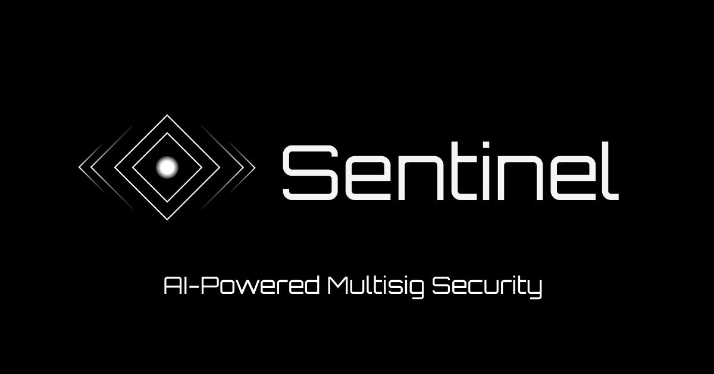

<p align="center">
  
</p>

# Sentinel

> The AI-powered security co-pilot for Solana multisigs.

## The Problem

Before signing any proposal, every multisig signer asks the same two questions:

1. Has anything happened onchain or offchain that affects this multisig and I don't know yet?
2. Does anyone else know and I don't?

Block explorers show transactions. Simulators show effects. Threat-intel feeds publish addresses. None of them sit between *your* signers and *your* approve button, in real time, with everything correlated.

## What Sentinel Does

Three real-time engines feeding a single verdict:

- **Onchain listener** — catches threats like durable-nonce staging, threshold mutations, signer changes, and config-authority swaps the moment they hit the chain.
- **Threat-intel agent** — ingests live security intelligence from external sources (starting with ZachXBT's investigations channel), extracts addresses, classifies role and severity, and cross-references against every protected multisig.
- **AI re-evaluator** — every proposal gets a 0-to-100 risk score and a plain-English rationale, evaluated against the multisig's full history. Verdicts re-run automatically when anything changes — onchain or off.

First-time actions, authority transfers, threshold mutations, large transfers, and interactions with flagged wallets are all surfaced before signers approve.

## The Drift Hook

Sentinel's durable-nonce attack detector would have caught the **$285M Drift exploit eight days before** the funds moved.

## Built For

Operators of high-value Solana multisigs — DAO treasuries, protocol security councils, foundations, and OTC desks. Today's focus is Squads V4, with cross-protocol expansion ahead.

## Architecture

Monorepo with hexagonal architecture (ports & adapters), built with Turborepo + pnpm workspaces.

```
sentinel/
├── apps/
│   ├── api/              # Express REST API
│   ├── reactor/          # AMQP event processor
│   ├── webhooks/         # Helius webhook receiver
│   └── watcher/          # Threat-intel ingestion worker (Telegram)
├── packages/
│   ├── common/           # Shared: logger, errors, environment
│   ├── domain/           # Entities, repository interfaces, domain events
│   ├── application/      # Use cases (command/query handlers), ports
│   └── infrastructure/   # Prisma, repositories, mappers, external clients
```

### Dependency Graph

```
common
  ↑
domain
  ↑
application
  ↑
infrastructure
  ↑
api & reactor
```

### Stack

| Layer          | Technology                          |
|----------------|-------------------------------------|
| Runtime        | Node.js + TypeScript (ESModules)    |
| Build          | Turborepo + pnpm workspaces         |
| HTTP           | Express                             |
| Database       | PostgreSQL + Prisma                  |
| Messaging      | RabbitMQ (AMQP)                     |
| DI Container   | Inversify                            |
| Linter/Format  | Biome                                |
| Blockchain     | Solana (web3.js)                     |

## Getting Started

### Prerequisites

- Node.js >= 20
- pnpm >= 10.33.0
- PostgreSQL
- RabbitMQ (for reactor)

### Setup

```bash
# Install dependencies
pnpm install

# Copy environment file
cp .env.example .env

# Generate Prisma client
pnpm prisma:generate

# Run database migrations
pnpm db:migrate

# Build all packages
pnpm build
```

### Development

```bash
# Start API in dev mode
pnpm dev:api

# Start Reactor in dev mode
pnpm dev:reactor

# Format code
pnpm format

# Lint code
pnpm lint
```

### Database

```bash
pnpm db:migrate    # Create/apply migrations
pnpm db:deploy     # Deploy migrations (production)
pnpm db:seed       # Seed database
pnpm db:reset      # Reset database + seed
pnpm prisma:generate  # Regenerate Prisma client
```

## Project Structure

### Hexagonal Architecture

**Domain** (`@sentinel/domain`) - Pure business logic. No external dependencies. Defines entities, repository interfaces (ports), and domain events.

**Application** (`@sentinel/application`) - Use cases orchestrating domain logic. Defines outbound port interfaces (e.g., `IEventPublisher`). Each use case extends `BaseUseCase<TInput, TOutput>`.

**Infrastructure** (`@sentinel/infrastructure`) - Implements repository interfaces using Prisma. Contains external client adapters, event publishers, and database mappers.

**Apps** - Thin presentation layer. Loads DI modules, configures Express routes, and wires everything together via Inversify.

### Adding a New Feature

1. Define entity in `packages/domain/src/entities/`
2. Define repository interface in `packages/domain/src/repositories/`
3. Add DI symbol to `packages/domain/src/types.ts`
4. Create use case in `packages/application/src/usecases/<feature>/`
5. Implement repository in `packages/infrastructure/src/repositories/`
6. Add Prisma model in `packages/infrastructure/src/prisma/schema/`
7. Wire DI bindings in the corresponding container modules
8. Create controller + route in `apps/api/src/presentation/<feature>/`

### Prisma Schema

Modular schema split by domain area in `packages/infrastructure/src/prisma/schema/`:

```
schema/
├── base.prisma          # Generator + datasource config
└── <domain>.prisma      # Add new schema files per domain
```

## Scripts

| Script              | Description                        |
|---------------------|------------------------------------|
| `pnpm build`        | Build all packages and apps        |
| `pnpm dev:api`      | Start API in development mode      |
| `pnpm dev:reactor`  | Start Reactor in development mode  |
| `pnpm --filter watcher dev` | Start Watcher in development mode |
| `pnpm format`       | Format code with Biome             |
| `pnpm lint`         | Lint code with Biome               |
| `pnpm check`        | Format + lint with auto-fix        |
| `pnpm clean`        | Remove dist, .turbo, tsbuildinfo   |
| `pnpm prisma:generate` | Generate Prisma client          |
| `pnpm db:migrate`   | Run database migrations            |
| `pnpm db:deploy`    | Deploy migrations (CI/production)  |
| `pnpm db:seed`      | Seed database                      |
| `pnpm db:reset`     | Reset database and reseed          |

## API

Base URL: `http://localhost:3000/api/v1`

| Method | Endpoint  | Description    |
|--------|-----------|----------------|
| GET    | `/health` | Health check   |

## License

Private
